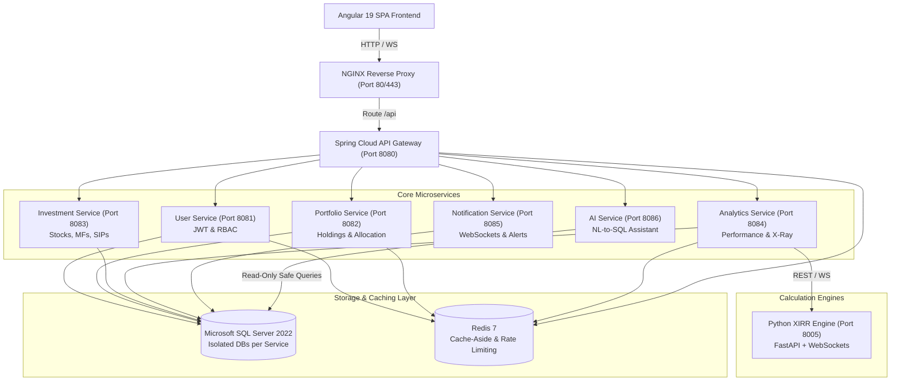

# InvestFlow — System Architecture & Design Specification

## 1. Overview
**InvestFlow** is an enterprise-grade FinTech Investment & Portfolio Management platform built on microservices architecture. It enables individual and institutional investors to track multi-asset portfolios (Stocks, Mutual Funds, SIPs), analyze returns via real-time XIRR calculations, receive live valuation updates via Server-Sent Events (SSE) and WebSockets, and interact with an AI Natural-Language-to-SQL financial assistant.

---

## 2. High-Level Architecture

---

## 3. Microservice Boundaries & Database Isolation

In strict adherence to microservice clean architecture, each service owns its data boundary to prevent tight coupling:

| Microservice | Technology | Database Name | Primary Responsibilities |
|---|---|---|---|
| **API Gateway** | Spring Cloud Gateway, Reactive | N/A | Route dispatching, correlation ID injection, rate limiting |
| **User Service** | Spring Boot 3.5, Security 6, JPA | `investflow_user` | User lifecycle, BCrypt auth, JWT token issuing/refresh, RBAC |
| **Portfolio Service** | Spring Boot 3.5, JPA, Redis | `investflow_portfolio` | Portfolios, asset allocation, holdings aggregation |
| **Investment Service** | Spring Boot 3.5, JPA | `investflow_investment` | Equity & MF instruments, SIP plans, buy/sell transactions |
| **Analytics Service** | Spring Boot 3.5, Redis, SSE | `investflow_analytics` | P&L, returns, portfolio X-ray, cash flow aggregation, SSE feed |
| **Notification Service**| Spring Boot 3.5, WebSockets | `investflow_notification`| User alerts, real-time portfolio push notifications |
| **AI Service** | Spring Boot 3.5, LLM Client | Read-Only View | Natural-language query translation to safe, read-only SQL |
| **XIRR Service** | Python 3.11, FastAPI, SciPy | Stateless | High-precision Newton-Raphson / Brent cash-flow XIRR |

---

## 4. Cross-Cutting Architectural Patterns
1. **Correlation ID Tracking**: Every incoming request receives an `X-Correlation-ID` header at NGINX / Gateway, propagated through MDC across asynchronous boundaries and downstream microservices.
2. **Cache-Aside Pattern**: Redis is utilized for high-frequency analytics and reference data. Invalidation triggers upon transactional writes.
3. **SSE vs. Polling**: SSE provides an unidirectional, lightweight, low-overhead HTTP stream for continuous valuation and P&L ticker updates to the client dashboard.
4. **WebSocket Communication**: Bidirectional WebSocket connection used for interactive real-time XIRR calculations and push notifications.
5. **Safe NL-to-SQL AI Guardrails**: Strict AST validation preventing `INSERT`, `UPDATE`, `DELETE`, `DROP`, `ALTER`, with execution confined to read-only views with timeout limits.
